# generate_flow_chart.md

This document contains Mermaid diagrams to visualize the project flow, architecture, and data pipelines of the DeepSeek AI Web Crawler. View this file in **Markdown Preview** (or on GitHub/GitLab) to see the Mermaid charts rendered here.

---

## 1. Overall System Architecture


---

## 2. Main Application Flow (Detailed)


---

## 3. Data Extraction Pipeline


---

## 4. Venue Data Model Structure


---

## 5. Configuration Flow


---

## 6. Page Processing Sequence


---

## 7. Error Handling Flow


---

## 8. State Management


---

## 9. Module Dependency Graph


---

## 10. LLM Extraction Strategy Workflow


---

## 11. CSV Export Process


---

## 12. Pagination & Rate Limiting

```mermaid
flowchart TD
    A[Start Loop] --> B[page_number = 1]
    B --> C[Construct URL<br/>BASE_URL?page=N]
    C --> D[Fetch and process page]
    D --> E{No Results<br/>Found?}
    
    E -->|Yes| F[Break loop]
    E -->|No| G{Venues<br/>extracted?}
    
    G -->|No| F
    G -->|Yes| H[Add venues to collection]
    H --> I[Increment page_number]
    I --> J[asyncio.sleep 2 seconds<br/>⏰ Rate Limiting]
    J --> C
    
    F --> K[End Loop]
    
    style J fill:#ffe6e6
```



---

## 13. Deduplication Strategy


---

## 14. Browser Configuration Options

```mermaid
graph TD
    A[get_browser_config] --> B[BrowserConfig Object]
    
    B --> C[browser_type: chromium<br/>🌐 Browser engine]
    B --> D[headless: False<br/>👁️ Show browser window]
    B --> E[verbose: True<br/>📝 Enable detailed logging]
    
    C --> F[Used by AsyncWebCrawler]
    D --> F
    E --> F
    
    style B fill:#e1f5ff
```



---

## 15. Complete End-to-End Flow (Simplified)

```mermaid
flowchart TD
    A[👤 User runs<br/>python main.py] --> B[🔑 Load GROQ_API_KEY<br/>from .env]
    B --> C[⚙️ Load config<br/>URL, selector, keys]
    C --> D[🌐 Open browser session<br/>Chromium via Crawl4AI]
    D --> E[📄 Fetch page 1]
    
    E --> F[🤖 Extract venues<br/>via LLM]
    F --> G[✅ Validate data<br/>required fields]
    G --> H[🔍 Check duplicates]
    H --> I[💾 Store venues]
    
    I --> J{More pages?}
    J -->|Yes| K[⏳ Wait 2 sec]
    K --> L[📄 Fetch next page]
    L --> F
    
    J -->|No| M[📊 Write CSV]
    M --> N[📈 Show stats]
    N --> O[✨ Done!]
    
    style A fill:#d4edda
    style O fill:#d4edda
```



---

## How to Use These Diagrams

### Viewing Options
1. **GitHub/GitLab**: These platforms render Mermaid automatically in Markdown files
2. **VS Code**: Install the "Markdown Preview Mermaid Support" extension
3. **Mermaid Live Editor**: Copy diagram code to https://mermaid.live/
4. **Documentation Sites**: Hugo, MkDocs, Docusaurus support Mermaid natively

### Exporting Diagrams
To export as images:
```bash
# Install mermaid-cli
npm install -g @mermaid-js/mermaid-cli

# Generate PNG from markdown
mmdc -i generate_flow_chart.md -o flow_chart.png

# Or generate SVG
mmdc -i generate_flow_chart.md -o flow_chart.svg
```

### Editing Diagrams
- Modify the text within \`\`\`mermaid blocks
- Follow Mermaid syntax: https://mermaid.js.org/intro/
- Use Mermaid Live Editor for real-time preview while editing

---

## Diagram Legend

### Common Shapes
- **Rectangle** `[text]`: Process or component
- **Diamond** `{text}`: Decision point
- **Rounded Rectangle** `([text])`: Start/End
- **Cylinder** (in some diagrams): Database/storage
- **Circle**: Connection point

### Common Arrows
- **Solid arrow** `-->`: Flow direction
- **Labeled arrow** `-->|label|`: Conditional flow
- **Dashed arrow** `-.->`: Optional or async flow

### Color Coding (when used)
- **Blue** `#e1f5ff`: Main application components
- **Green** `#d4edda`: Utility modules
- **Yellow** `#fff3cd`: Data models
- **Red** `#ffe6e6`: Critical operations (rate limiting, errors)

---

## Extending These Diagrams

When adding new features, update the relevant diagrams:

1. **New module/component**: Update Architecture diagram (#1) and Dependency Graph (#9)
2. **New data flow**: Update Data Extraction Pipeline (#3)
3. **New configuration**: Update Configuration Flow (#5)
4. **New error handling**: Update Error Handling Flow (#7)
5. **UI/workflow changes**: Update Main Application Flow (#2)

Keep diagrams in sync with code changes for accurate documentation!

---

**Last Updated**: January 2026  
**Mermaid Version**: Compatible with v9.0+
